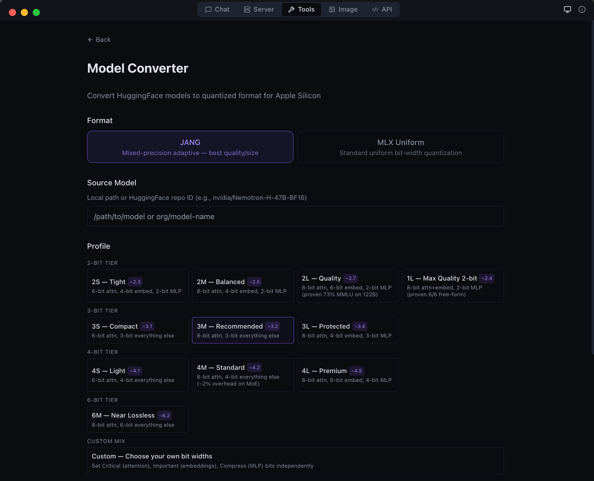

<p align="center">
  <picture>
    <source media="(prefers-color-scheme: dark)" srcset="https://vmlx.net/logos/png/wordmark-dark-600x150.png">
    <source media="(prefers-color-scheme: light)" srcset="https://vmlx.net/logos/png/wordmark-light-600x150.png">
    
  </picture>
</p>

<h3 align="center">Local AI for Apple Silicon</h3>

<p align="center">
  Run LLMs, VLMs, and image generation models entirely on your Mac.<br>
  No cloud. No API keys. No data leaving your machine.
</p>

<p align="center">
  <a href="https://pypi.org/project/vmlx/"></a>
  <a href="https://github.com/jjang-ai/vmlx/blob/main/LICENSE"></a>
  <a href="https://github.com/jjang-ai/vmlx"></a>
  
  
  
</p>

<p align="center">
  <a href="#quickstart">Quickstart</a> &bull;
  <a href="#desktop-app">Desktop App</a> &bull;
  <a href="#features">Features</a> &bull;
  <a href="#jang-quantization">JANG</a> &bull;
  <a href="#image-generation">Image Gen</a> &bull;
  <a href="#api-reference">API</a> &bull;
  <a href="#cli-commands">CLI</a> &bull;
  <a href="#contributing">Contributing</a>
</p>

---

<table align="center">
<tr>
<td align="center"></td>
<td align="center"></td>
</tr>
<tr>
<td align="center"><em>Chat with a JANG quantized model — thinking mode, tool calling, and reasoning parser auto-detected</em></td>
<td align="center"><em>Agentic chat with full coding capabilities — tool use and structured output</em></td>
</tr>
</table>

---

## Quickstart

```bash
pip install vmlx
vmlx serve mlx-community/Qwen3-8B-4bit
```

Your local AI server is now running at `http://0.0.0.0:8000` with an OpenAI-compatible API.

```python
from openai import OpenAI

client = OpenAI(base_url="http://localhost:8000/v1", api_key="not-needed")
response = client.chat.completions.create(
    model="local",
    messages=[{"role": "user", "content": "Hello!"}],
    stream=True,
)
for chunk in response:
    print(chunk.choices[0].delta.content or "", end="", flush=True)
```

Also works with the **Anthropic SDK**:

```python
import anthropic

client = anthropic.Anthropic(base_url="http://localhost:8000/v1", api_key="not-needed")
message = client.messages.create(
    model="local",
    max_tokens=1024,
    messages=[{"role": "user", "content": "Hello!"}],
)
print(message.content[0].text)
```

---

## Desktop App

vMLX includes a native macOS desktop app (MLX Studio) with 5 modes:

| Mode | Description |
|------|-------------|
| **Chat** | Conversation interface with chat history, thinking mode, tool calling, agentic coding |
| **Server** | Manage model sessions — start, stop, configure, monitor |
| **Image** | Text-to-image generation with Flux models |
| **Tools** | Model converter (MLX + JANG), GGUF-to-MLX, inspector, diagnostics |
| **API** | Live endpoint reference with copy-pasteable code snippets |

<table align="center">
<tr>
<td align="center"></td>
<td align="center"></td>
</tr>
<tr>
<td align="center"><em>Image generation with Flux model selection</em></td>
<td align="center"><em>Developer tools — model list and JANG quantization</em></td>
</tr>
<tr>
<td align="center"></td>
<td align="center"></td>
</tr>
<tr>
<td align="center"><em>Anthropic Messages API endpoint — full compatibility</em></td>
<td align="center"><em>GGUF to MLX conversion — bring your own models</em></td>
</tr>
</table>

### Download

Get the latest DMG from [MLX Studio Releases](https://github.com/jjang-ai/mlxstudio/releases), or build from source:

```bash
git clone https://github.com/jjang-ai/vmlx.git
cd vmlx/panel
npm install && npm run build
npx electron-builder --mac dmg
```

### Menu Bar

vMLX lives in your menu bar showing all running models, GPU memory usage, and quick controls.

<p align="center">
  
</p>

---

## Features

### Inference Engine

| Feature | Description |
|---------|-------------|
| **Continuous Batching** | Handle multiple concurrent requests efficiently |
| **Prefix Cache** | Reuse KV states for repeated prompts — makes follow-up messages instant |
| **Paged KV Cache** | Block-based caching with content-addressable deduplication |
| **KV Cache Quantization** | Compress cached states to q4/q8 for 2-4x memory savings |
| **Disk Cache (L2)** | Persist prompt caches to SSD — survives server restarts |
| **Block Disk Cache** | Per-block persistent cache paired with paged KV cache |
| **Speculative Decoding** | Small draft model proposes tokens for 20-90% speedup |
| **JIT Compilation** | `mx.compile` Metal kernel fusion (experimental) |
| **Hybrid SSM Support** | Mamba/GatedDeltaNet layers handled correctly alongside attention |

### 5-Layer Cache Architecture

```
Request -> Tokens
    |
L1: Memory-Aware Prefix Cache (or Paged Cache)
    | miss
L2: Disk Cache (or Block Disk Store)
    | miss
Inference -> float16 KV states
    |
KV Quantization -> q4/q8 for storage
    |
Store back into L1 + L2
```

### Model Support

| Type | Models |
|------|--------|
| **Text LLMs** | Qwen 2/2.5/3/3.5, Llama 3/3.1/3.2/3.3/4, Mistral/Mixtral, Gemma 3, Phi-4, DeepSeek, GLM-4, MiniMax, Nemotron, StepFun, and any mlx-lm model |
| **Vision LLMs** | Qwen-VL, Qwen3.5-VL, Pixtral, InternVL, LLaVA, Gemma 3n |
| **MoE Models** | Qwen 3.5 MoE (A3B/A10B), Mixtral, DeepSeek V2/V3, MiniMax M2.5, Llama 4 |
| **Hybrid SSM** | Nemotron-H, Jamba, GatedDeltaNet (Mamba + Attention) |
| **JANG Models** | Any model quantized with JANG adaptive mixed-precision |
| **Image Gen** | Flux Schnell/Dev, Z-Image Turbo, Flux Klein (via mflux) |
| **Embeddings** | Any mlx-lm compatible embedding model |
| **Reranking** | Cross-encoder reranking models |
| **Audio** | Kokoro TTS, Whisper STT (via mlx-audio) |

### Tool Calling

Auto-detected parsers for every major model family:

`qwen` · `llama` · `mistral` · `hermes` · `deepseek` · `glm47` · `minimax` · `nemotron` · `granite` · `functionary` · `xlam` · `kimi` · `step3p5`

### Reasoning / Thinking Mode

Auto-detected reasoning parsers that extract `<think>` blocks:

`qwen3` (Qwen3, QwQ, MiniMax, StepFun) · `deepseek_r1` (DeepSeek R1, Gemma 3, GLM, Phi-4) · `openai_gptoss` (GLM Flash, GPT-OSS)

---

## JANG Quantization

JANG is an adaptive mixed-precision quantization format created by [Jinho Jang](https://github.com/jjang-ai). It assigns different bit widths to different layers based on sensitivity — attention layers get more bits, MLP layers get fewer.

<table align="center">
<tr>
<td align="center"></td>
</tr>
<tr>
<td align="center"><em>Pre-quantized JANG models available at <a href="https://huggingface.co/JANGQ-AI">JANGQ-AI on HuggingFace</a></em></td>
</tr>
</table>

### Why JANG?

- **Better quality at same size** — 2-bit JANG matches 4-bit uniform on many models
- **Proven**: 73% MMLU on Qwen3.5-122B at 2.4 bits average
- **Native MLX inference** — weights stay quantized via `QuantizedLinear` + `quantized_matmul`
- **Fast loading** — repacks in seconds (not minutes of dequantization)
- **Works with all caching** — prefix cache, paged cache, KV quant, disk cache all compatible

### Profiles

| Profile | Attention | Embeddings | MLP | Avg Bits | Use Case |
|---------|-----------|------------|-----|----------|----------|
| `JANG_2M` | 8-bit | 4-bit | 2-bit | ~2.5 | Balanced compression |
| `JANG_2L` | 8-bit | 6-bit | 2-bit | ~2.7 | Quality 2-bit |
| `JANG_1L` | 8-bit | 8-bit | 2-bit | ~2.4 | Max quality 2-bit |
| `JANG_3M` | 8-bit | 3-bit | 3-bit | ~3.2 | **Recommended** |
| `JANG_4M` | 8-bit | 4-bit | 4-bit | ~4.2 | Standard quality |
| `JANG_6M` | 8-bit | 6-bit | 6-bit | ~6.2 | Near lossless |

### Convert

```bash
pip install vmlx[jang]

# Preset profile
vmlx convert my-model --jang-profile JANG_3M

# Custom bit widths per tier
vmlx convert my-model --jang-profile CUSTOM_8_4_3

# Activation-aware calibration (better at 2-3 bit)
vmlx convert my-model --jang-profile JANG_2L --calibration-method activations

# Serve the converted model
vmlx serve ./my-model-JANG_3M --continuous-batching --use-paged-cache
```

Find pre-quantized JANG models at [JANGQ-AI on HuggingFace](https://huggingface.co/JANGQ-AI).

---

## Image Generation

Generate images locally with Flux models via [mflux](https://github.com/filipstrand/mflux).

```bash
pip install vmlx[image]
vmlx serve ~/.mlxstudio/models/image/flux1-schnell-4bit
```

### API

```python
response = client.images.generate(
    model="schnell",
    prompt="A cat astronaut floating in space with Earth in the background",
    size="1024x1024",
    n=1,
)
```

### Supported Models

| Model | Steps | Speed | Quality |
|-------|-------|-------|---------|
| **Flux Schnell** | 4 | Fastest | Good |
| **Flux Dev** | 20 | Slow | Best |
| **Z-Image Turbo** | 4 | Fast | Sharp |
| **Flux Klein 4B** | 20 | Medium | Compact |
| **Flux Klein 9B** | 20 | Medium | Balanced |

---

## API Reference

### Endpoints

| Method | Path | Description |
|--------|------|-------------|
| `POST` | `/v1/chat/completions` | OpenAI Chat Completions API (streaming + non-streaming) |
| `POST` | `/v1/messages` | Anthropic Messages API |
| `POST` | `/v1/responses` | OpenAI Responses API |
| `POST` | `/v1/completions` | Text completions |
| `POST` | `/v1/images/generations` | Image generation |
| `POST` | `/v1/embeddings` | Text embeddings |
| `POST` | `/v1/rerank` | Document reranking |
| `POST` | `/v1/audio/transcriptions` | Speech-to-text (Whisper) |
| `POST` | `/v1/audio/speech` | Text-to-speech (Kokoro) |
| `GET` | `/v1/models` | List loaded models |
| `GET` | `/v1/cache/stats` | Cache statistics |
| `GET` | `/health` | Server health check |

### Server Options

```bash
vmlx serve <model> \
  --host 0.0.0.0 \
  --port 8000 \
  --api-key sk-your-key \
  --continuous-batching \
  --enable-prefix-cache \
  --use-paged-cache \
  --kv-cache-quantization q8 \
  --enable-disk-cache \
  --enable-jit \
  --tool-call-parser auto \
  --reasoning-parser auto \
  --log-level INFO
```

---

## CLI Commands

```bash
vmlx serve <model>              # Start inference server
vmlx convert <model> --bits 4   # MLX uniform quantization
vmlx convert <model> -j JANG_3M # JANG adaptive quantization
vmlx info <model>               # Model metadata and config
vmlx doctor <model>             # Run diagnostics
vmlx bench <model>              # Performance benchmarks
```

---

## Architecture

```
+--------------------------------------------+
|          Desktop App (Electron)             |
|   Chat | Server | Image | Tools | API      |
+--------------------------------------------+
|          Session Manager (TypeScript)       |
|   Process spawn | Health monitor | Tray     |
+--------------------------------------------+
|         vMLX Engine (Python / FastAPI)       |
|  +--------+  +---------+  +-----------+    |
|  |Simple  |  | Batched |  | ImageGen  |    |
|  |Engine  |  | Engine  |  | Engine    |    |
|  +---+----+  +----+----+  +-----+-----+    |
|      |            |              |          |
|  +---+------------+--+    +-----+-----+    |
|  | mlx-lm / mlx-vlm  |    |  mflux    |    |
|  | + JANG Loader      |    |           |    |
|  +--------+-----------+    +-----------+    |
|           |                                 |
|  +--------+----------------------------+    |
|  |       MLX Metal GPU Backend          |    |
|  | quantized_matmul | KV cache | SDPA   |    |
|  +--------------------------------------+    |
+--------------------------------------------+
|  L1: Prefix Cache (Memory-Aware / Paged)    |
|  L2: Disk Cache (Persistent / Block Store)  |
|  KV Quant: q4/q8 at storage boundary       |
+--------------------------------------------+
```

---

## Contributing

```bash
git clone https://github.com/jjang-ai/vmlx.git
cd vmlx

# Python
python -m venv .venv && source .venv/bin/activate
pip install -e ".[dev,jang,image]"
pytest tests/ -k "not Async"    # 1894+ tests

# Electron
cd panel && npm install
npm run dev                      # Development mode
npx vitest run                   # 1253+ tests
```

---

## License

Apache License 2.0 — see [LICENSE](LICENSE).

---

<p align="center">
  Built by <a href="https://github.com/jjang-ai">Jinho Jang</a> (eric@jangq.ai)<br>
  <a href="https://jangq.ai">JANGQ AI</a> &bull; <a href="https://pypi.org/project/vmlx/">PyPI</a> &bull; <a href="https://github.com/jjang-ai/vmlx">GitHub</a> &bull; <a href="https://github.com/jjang-ai/mlxstudio/releases">Downloads</a>
</p>
