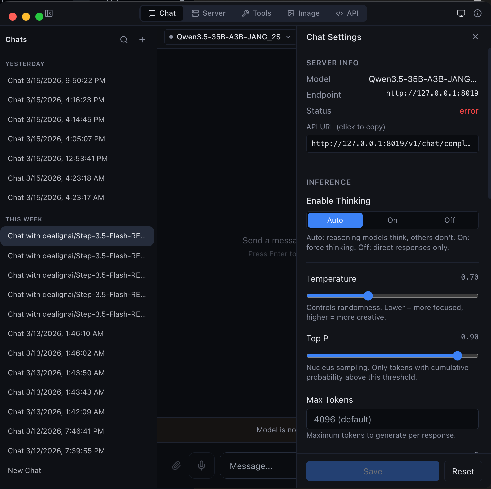
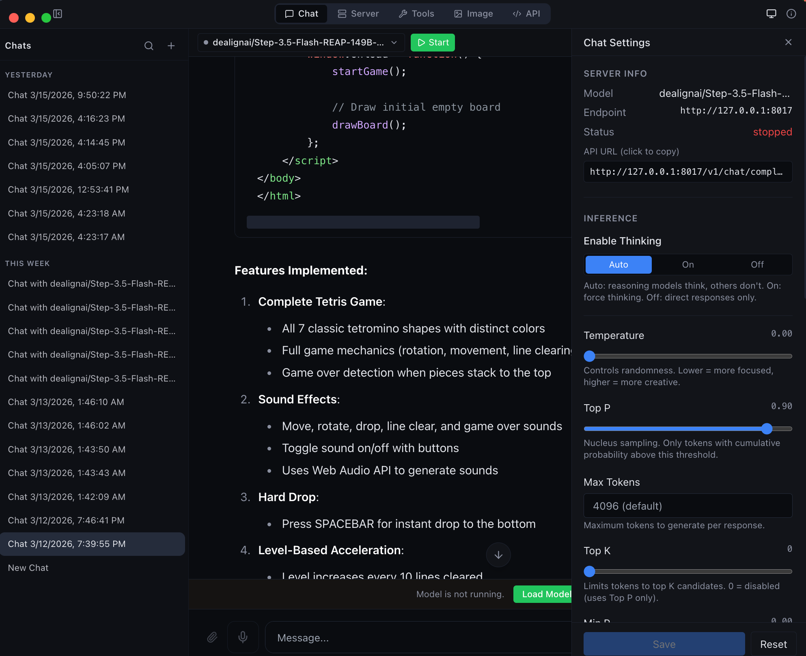
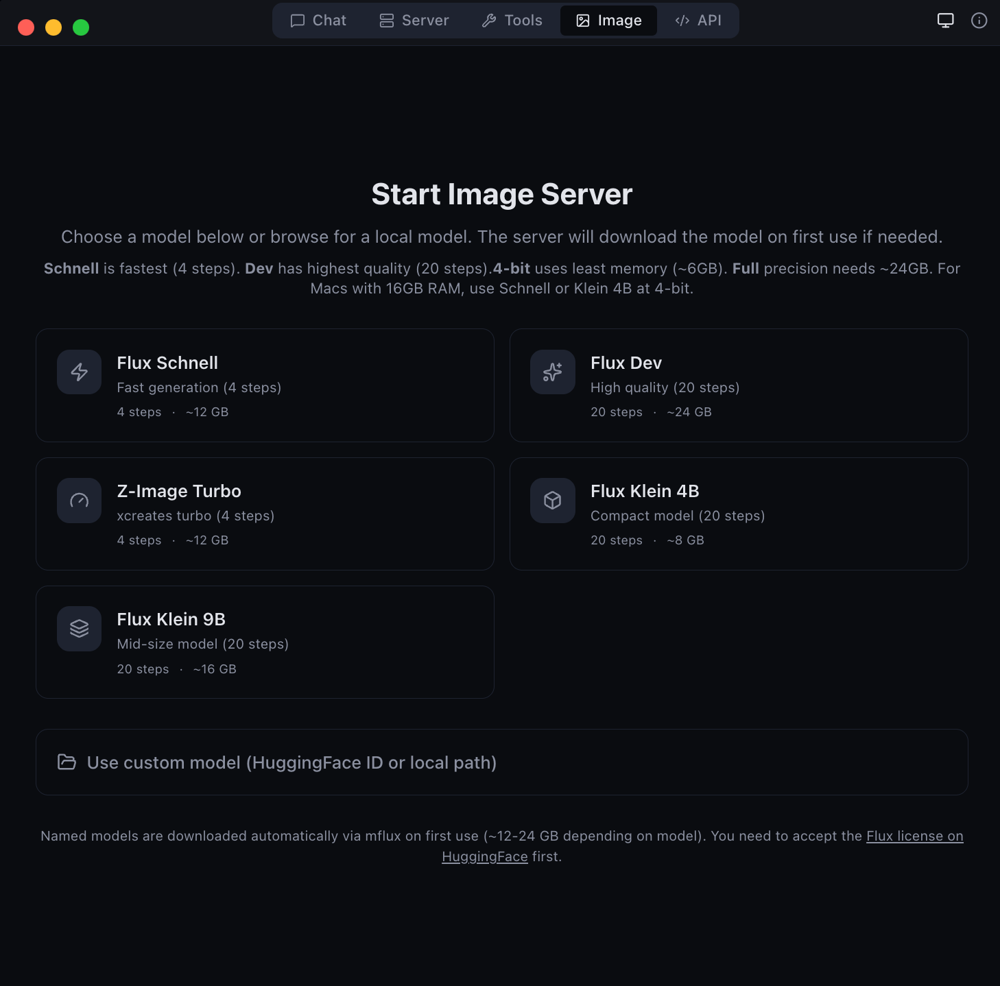
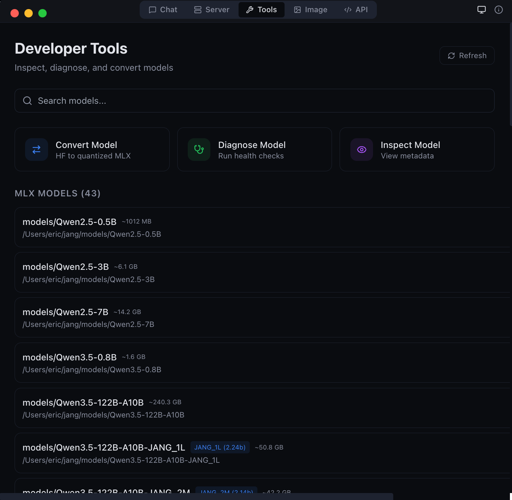
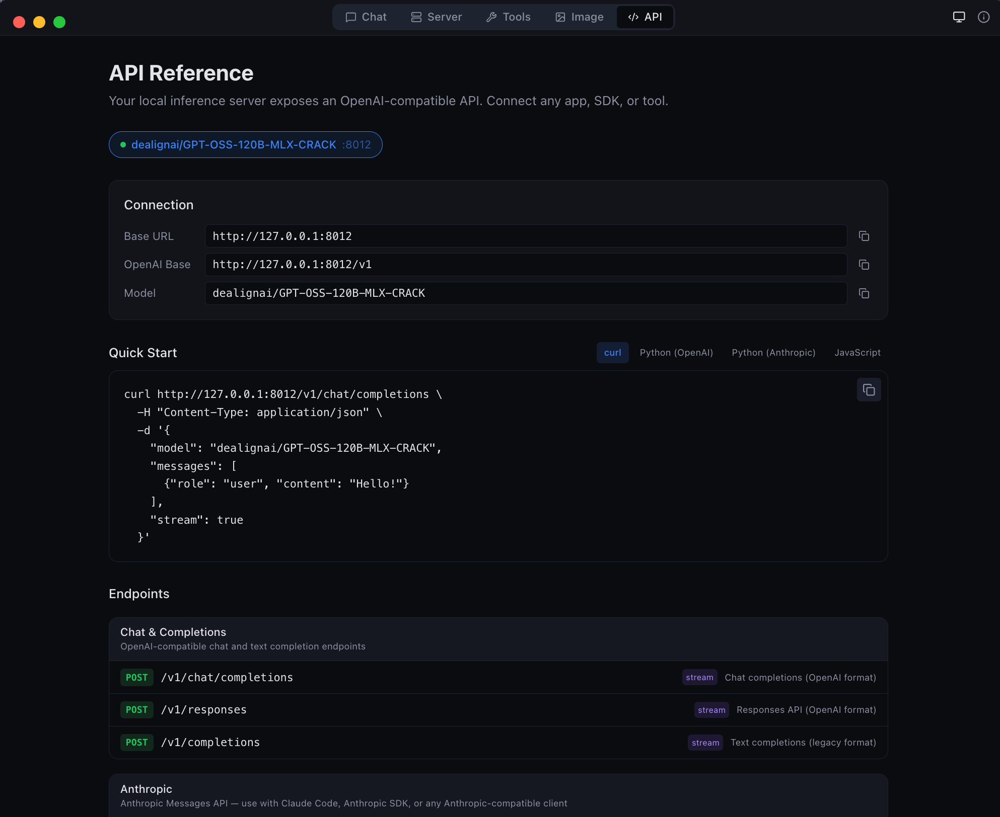
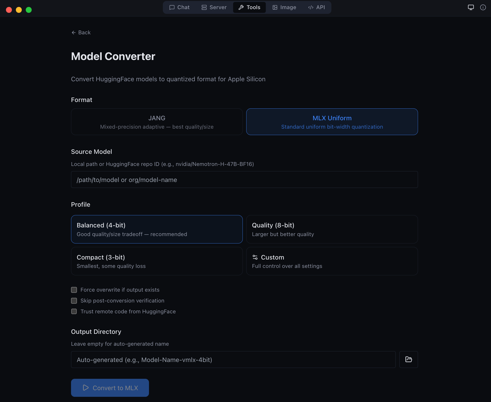
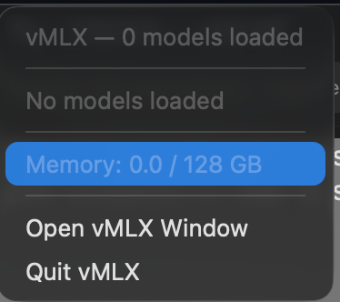

<p align="center">
  <picture>
    <source media="(prefers-color-scheme: dark)" srcset="assets/logo-wide-dark.png">
    <source media="(prefers-color-scheme: light)" srcset="assets/logo-wide-light.png">
    
  </picture>
</p>

<h3 align="center">Local AI Engine for Apple Silicon</h3>

<p align="center">
  Run LLMs, VLMs, and image generation models entirely on your Mac.<br>
  OpenAI + Anthropic compatible API. No cloud. No API keys. No data leaving your machine.
</p>

<p align="center">
  <a href="https://pypi.org/project/vmlx/"></a>
  <a href="https://github.com/jjang-ai/vmlx/blob/main/LICENSE"></a>
  <a href="https://github.com/jjang-ai/vmlx"></a>
  
  
  
</p>

<p align="center">
  <a href="#quickstart">Quickstart</a> &bull;
  <a href="#model-support">Models</a> &bull;
  <a href="#features">Features</a> &bull;
  <a href="#image-generation">Image Gen</a> &bull;
  <a href="#api-reference">API</a> &bull;
  <a href="#desktop-app">Desktop App</a> &bull;
  <a href="#advanced-quantization">JANG</a> &bull;
  <a href="#cli-commands">CLI</a> &bull;
  <a href="#configuration">Config</a> &bull;
  <a href="#contributing">Contributing</a>
</p>

---

<table align="center">
<tr>
<td align="center"></td>
<td align="center"></td>
</tr>
<tr>
<td align="center"><em>Chat with any MLX model -- thinking mode, streaming, and syntax highlighting</em></td>
<td align="center"><em>Agentic chat with full coding capabilities -- tool use and structured output</em></td>
</tr>
</table>

---

## Quickstart

### Install from PyPI

Published on [PyPI as `vmlx`](https://pypi.org/project/vmlx/) -- install and run in one command:

```bash
# Recommended: uv (fast, no venv hassle)
brew install uv
uv tool install vmlx
vmlx serve mlx-community/Qwen3-8B-4bit

# Or: pipx (isolates from system Python)
brew install pipx
pipx install vmlx
vmlx serve mlx-community/Qwen3-8B-4bit

# Or: pip in a virtual environment
python3 -m venv ~/.vmlx-env && source ~/.vmlx-env/bin/activate
pip install vmlx
vmlx serve mlx-community/Qwen3-8B-4bit
```

> **Note:** On macOS 14+, bare `pip install` fails with "externally-managed-environment". Use `uv`, `pipx`, or a venv.

Your local AI server is now running at `http://0.0.0.0:8000` with an OpenAI + Anthropic compatible API. Works with any model from [mlx-community](https://huggingface.co/mlx-community) -- thousands of models ready to go.

### Or download the desktop app

Get [MLX Studio](https://github.com/jjang-ai/mlxstudio/releases/latest) -- a native macOS app with chat UI, model management, image generation, and developer tools. No terminal required. Just download the DMG and drag to Applications.

### Use with OpenAI SDK

```python
from openai import OpenAI

client = OpenAI(base_url="http://localhost:8000/v1", api_key="not-needed")
response = client.chat.completions.create(
    model="local",
    messages=[{"role": "user", "content": "Hello!"}],
    stream=True,
)
for chunk in response:
    print(chunk.choices[0].delta.content or "", end="", flush=True)
```

### Use with Anthropic SDK

```python
import anthropic

client = anthropic.Anthropic(base_url="http://localhost:8000/v1", api_key="not-needed")
message = client.messages.create(
    model="local",
    max_tokens=1024,
    messages=[{"role": "user", "content": "Hello!"}],
)
print(message.content[0].text)
```

### Use with curl

```bash
curl http://localhost:8000/v1/chat/completions \
  -H "Content-Type: application/json" \
  -d '{
    "model": "local",
    "messages": [{"role": "user", "content": "Hello!"}],
    "stream": true
  }'
```

---

## Model Support

vMLX runs any MLX model. Point it at a HuggingFace repo or local path and go.

| Type | Models |
|------|--------|
| **Text LLMs** | Qwen 2/2.5/3/3.5, Llama 3/3.1/3.2/3.3/4, Mistral/Mixtral, Gemma 3, Phi-4, DeepSeek, GLM-4, MiniMax, Nemotron, StepFun, and any mlx-lm model |
| **Vision LLMs** | Qwen-VL, Qwen3.5-VL, Pixtral, InternVL, LLaVA, Gemma 3n |
| **MoE Models** | Qwen 3.5 MoE (A3B/A10B), Mixtral, DeepSeek V2/V3, MiniMax M2.5, Llama 4 |
| **Hybrid SSM** | Nemotron-H, Jamba, GatedDeltaNet (Mamba + Attention) |
| **Image Gen** | Flux Schnell/Dev, Z-Image Turbo, Flux Klein (via mflux) |
| **Embeddings** | Any mlx-lm compatible embedding model |
| **Reranking** | Cross-encoder reranking models |
| **Audio** | Kokoro TTS, Whisper STT (via mlx-audio) |

---

## Features

### Inference Engine

| Feature | Description |
|---------|-------------|
| **Continuous Batching** | Handle multiple concurrent requests efficiently |
| **Prefix Cache** | Reuse KV states for repeated prompts -- makes follow-up messages instant |
| **Paged KV Cache** | Block-based caching with content-addressable deduplication |
| **KV Cache Quantization** | Compress cached states to q4/q8 for 2-4x memory savings |
| **Disk Cache (L2)** | Persist prompt caches to SSD -- survives server restarts |
| **Block Disk Cache** | Per-block persistent cache paired with paged KV cache |
| **Speculative Decoding** | Small draft model proposes tokens for 20-90% speedup |
| **JIT Compilation** | `mx.compile` Metal kernel fusion (experimental) |
| **Hybrid SSM Support** | Mamba/GatedDeltaNet layers handled correctly alongside attention |

### 5-Layer Cache Architecture

```
Request -> Tokens
    |
L1: Memory-Aware Prefix Cache (or Paged Cache)
    | miss
L2: Disk Cache (or Block Disk Store)
    | miss
Inference -> float16 KV states
    |
KV Quantization -> q4/q8 for storage
    |
Store back into L1 + L2
```

### Tool Calling

Auto-detected parsers for every major model family:

`qwen` - `llama` - `mistral` - `hermes` - `deepseek` - `glm47` - `minimax` - `nemotron` - `granite` - `functionary` - `xlam` - `kimi` - `step3p5`

### Reasoning / Thinking Mode

Auto-detected reasoning parsers that extract `<think>` blocks:

`qwen3` (Qwen3, QwQ, MiniMax, StepFun) - `deepseek_r1` (DeepSeek R1, Gemma 3, GLM, Phi-4) - `openai_gptoss` (GLM Flash, GPT-OSS)

### Audio

| Feature | Description |
|---------|-------------|
| **Text-to-Speech** | Kokoro TTS via mlx-audio -- multiple voices, streaming output |
| **Speech-to-Text** | Whisper STT via mlx-audio -- transcription and translation |

---

## Image Generation

Generate images locally with Flux models via [mflux](https://github.com/filipstrand/mflux).

```bash
pip install vmlx[image]
vmlx serve ~/.mlxstudio/models/image/flux1-schnell-4bit
```

### API

```bash
# curl
curl http://localhost:8000/v1/images/generations \
  -H "Content-Type: application/json" \
  -d '{
    "model": "schnell",
    "prompt": "A cat astronaut floating in space with Earth in the background",
    "size": "1024x1024",
    "n": 1
  }'
```

```python
# Python (OpenAI SDK)
response = client.images.generate(
    model="schnell",
    prompt="A cat astronaut floating in space with Earth in the background",
    size="1024x1024",
    n=1,
)
```

### Supported Models

| Model | Steps | Speed | Quality |
|-------|-------|-------|---------|
| **Flux Schnell** | 4 | Fastest | Good |
| **Flux Dev** | 20 | Slow | Best |
| **Z-Image Turbo** | 4 | Fast | Sharp |
| **Flux Klein 4B** | 20 | Medium | Compact |
| **Flux Klein 9B** | 20 | Medium | Balanced |

---

## API Reference

### Endpoints

| Method | Path | Description |
|--------|------|-------------|
| `POST` | `/v1/chat/completions` | OpenAI Chat Completions API (streaming + non-streaming) |
| `POST` | `/v1/messages` | Anthropic Messages API |
| `POST` | `/v1/responses` | OpenAI Responses API |
| `POST` | `/v1/completions` | Text completions |
| `POST` | `/v1/images/generations` | Image generation |
| `POST` | `/v1/embeddings` | Text embeddings |
| `POST` | `/v1/rerank` | Document reranking |
| `POST` | `/v1/audio/transcriptions` | Speech-to-text (Whisper) |
| `POST` | `/v1/audio/speech` | Text-to-speech (Kokoro) |
| `GET` | `/v1/models` | List loaded models |
| `GET` | `/v1/cache/stats` | Cache statistics |
| `GET` | `/health` | Server health check |

### curl Examples

**Chat completion (streaming)**

```bash
curl http://localhost:8000/v1/chat/completions \
  -H "Content-Type: application/json" \
  -d '{
    "model": "local",
    "messages": [{"role": "user", "content": "Explain quantum computing in 3 sentences."}],
    "stream": true,
    "temperature": 0.7
  }'
```

**Chat completion with thinking mode**

```bash
curl http://localhost:8000/v1/chat/completions \
  -H "Content-Type: application/json" \
  -d '{
    "model": "local",
    "messages": [{"role": "user", "content": "Solve: what is 23 * 47?"}],
    "enable_thinking": true,
    "stream": true
  }'
```

**Tool calling**

```bash
curl http://localhost:8000/v1/chat/completions \
  -H "Content-Type: application/json" \
  -d '{
    "model": "local",
    "messages": [{"role": "user", "content": "What is the weather in Tokyo?"}],
    "tools": [{
      "type": "function",
      "function": {
        "name": "get_weather",
        "description": "Get current weather for a location",
        "parameters": {
          "type": "object",
          "properties": {
            "location": {"type": "string", "description": "City name"}
          },
          "required": ["location"]
        }
      }
    }]
  }'
```

**Anthropic Messages API**

```bash
curl http://localhost:8000/v1/messages \
  -H "Content-Type: application/json" \
  -H "x-api-key: not-needed" \
  -H "anthropic-version: 2023-06-01" \
  -d '{
    "model": "local",
    "max_tokens": 1024,
    "messages": [{"role": "user", "content": "Hello!"}]
  }'
```

**Embeddings**

```bash
curl http://localhost:8000/v1/embeddings \
  -H "Content-Type: application/json" \
  -d '{
    "model": "local",
    "input": "The quick brown fox jumps over the lazy dog"
  }'
```

**Text-to-speech**

```bash
curl http://localhost:8000/v1/audio/speech \
  -H "Content-Type: application/json" \
  -d '{
    "model": "kokoro",
    "input": "Hello, welcome to vMLX!",
    "voice": "af_heart"
  }' --output speech.wav
```

**Speech-to-text**

```bash
curl http://localhost:8000/v1/audio/transcriptions \
  -F file=@audio.wav \
  -F model=whisper
```

**Image generation**

```bash
curl http://localhost:8000/v1/images/generations \
  -H "Content-Type: application/json" \
  -d '{
    "model": "schnell",
    "prompt": "A mountain landscape at sunset",
    "size": "1024x1024"
  }'
```

**Reranking**

```bash
curl http://localhost:8000/v1/rerank \
  -H "Content-Type: application/json" \
  -d '{
    "model": "local",
    "query": "What is machine learning?",
    "documents": [
      "ML is a subset of AI",
      "The weather is sunny today",
      "Neural networks learn from data"
    ]
  }'
```

**Cache stats**

```bash
curl http://localhost:8000/v1/cache/stats
```

**Health check**

```bash
curl http://localhost:8000/health
```

---

## Desktop App

vMLX includes a native macOS desktop app (MLX Studio) with 5 modes:

| Mode | Description |
|------|-------------|
| **Chat** | Conversation interface with chat history, thinking mode, tool calling, agentic coding |
| **Server** | Manage model sessions -- start, stop, configure, monitor |
| **Image** | Text-to-image generation with Flux models |
| **Tools** | Model converter, GGUF-to-MLX, inspector, diagnostics |
| **API** | Live endpoint reference with copy-pasteable code snippets |

<table align="center">
<tr>
<td align="center"></td>
<td align="center"></td>
</tr>
<tr>
<td align="center"><em>Image generation with Flux model selection</em></td>
<td align="center"><em>Developer tools -- model conversion and diagnostics</em></td>
</tr>
<tr>
<td align="center"></td>
<td align="center"></td>
</tr>
<tr>
<td align="center"><em>Anthropic Messages API endpoint -- full compatibility</em></td>
<td align="center"><em>GGUF to MLX conversion -- bring your own models</em></td>
</tr>
</table>

### Download

Get the latest DMG from [MLX Studio Releases](https://github.com/jjang-ai/mlxstudio/releases/latest), or build from source:

```bash
git clone https://github.com/jjang-ai/vmlx.git
cd vmlx/panel
npm install && npm run build
npx electron-builder --mac dmg
```

### Menu Bar

vMLX lives in your menu bar showing all running models, GPU memory usage, and quick controls.

<p align="center">
  
</p>

---

## Advanced Quantization

vMLX supports standard MLX quantization (4-bit, 8-bit uniform) out of the box. For users who want to push further, **JANG adaptive mixed-precision** assigns different bit widths to different layer types -- attention gets more bits, MLP layers get fewer -- achieving better quality at the same model size.

### JANG Profiles

| Profile | Attention | Embeddings | MLP | Avg Bits | Use Case |
|---------|-----------|------------|-----|----------|----------|
| `JANG_2M` | 8-bit | 4-bit | 2-bit | ~2.5 | Balanced compression |
| `JANG_2L` | 8-bit | 6-bit | 2-bit | ~2.7 | Quality 2-bit |
| `JANG_3M` | 8-bit | 3-bit | 3-bit | ~3.2 | **Recommended** |
| `JANG_4M` | 8-bit | 4-bit | 4-bit | ~4.2 | Standard quality |
| `JANG_6M` | 8-bit | 6-bit | 6-bit | ~6.2 | Near lossless |

### Convert

```bash
pip install vmlx[jang]

# Standard MLX quantization
vmlx convert my-model --bits 4

# JANG adaptive quantization
vmlx convert my-model --jang-profile JANG_3M

# Activation-aware calibration (better at 2-3 bit)
vmlx convert my-model --jang-profile JANG_2L --calibration-method activations

# Serve the converted model
vmlx serve ./my-model-JANG_3M --continuous-batching --use-paged-cache
```

Pre-quantized JANG models are available at [JANGQ-AI on HuggingFace](https://huggingface.co/JANGQ-AI).

---

## CLI Commands

```bash
vmlx serve <model>              # Start inference server
vmlx convert <model> --bits 4   # MLX uniform quantization
vmlx convert <model> -j JANG_3M # JANG adaptive quantization
vmlx info <model>               # Model metadata and config
vmlx doctor <model>             # Run diagnostics
vmlx bench <model>              # Performance benchmarks
```

---

## Configuration

### Server Options

```bash
vmlx serve <model> \
  --host 0.0.0.0 \              # Bind address (default: 0.0.0.0)
  --port 8000 \                 # Port (default: 8000)
  --api-key sk-your-key \       # Optional API key authentication
  --continuous-batching \       # Enable concurrent request handling
  --enable-prefix-cache \       # Reuse KV states for repeated prompts
  --use-paged-cache \           # Block-based KV cache with dedup
  --kv-cache-quantization q8 \  # Quantize cache: q4 or q8
  --enable-disk-cache \         # Persist cache to SSD
  --enable-jit \                # JIT Metal kernel compilation
  --tool-call-parser auto \     # Auto-detect tool call format
  --reasoning-parser auto \     # Auto-detect thinking format
  --log-level INFO \            # Logging: DEBUG, INFO, WARNING, ERROR
  --max-model-len 8192 \        # Max context length
  --speculative-model <model> \ # Draft model for speculative decoding
  --cors-origins "*"            # CORS allowed origins
```

### Quantization Options

```bash
vmlx convert <model> \
  --bits 4 \                    # Uniform quantization bits: 2, 3, 4, 6, 8
  --group-size 64 \             # Quantization group size (default: 64)
  --output ./output-dir \       # Output directory
  --jang-profile JANG_3M \      # JANG mixed-precision profile
  --calibration-method activations  # Activation-aware calibration
```

### Image Generation Options

```bash
pip install vmlx[image]

vmlx serve <flux-model> \
  --port 8001 \                 # Run on separate port from text model
  --host 0.0.0.0
```

### Audio Options

TTS and STT require the `mlx-audio` package:

```bash
pip install mlx-audio

# TTS: serve Kokoro model
vmlx serve kokoro --port 8002

# STT: serve Whisper model
vmlx serve whisper --port 8003
```

### Optional Dependencies

```bash
pip install vmlx              # Core: text LLMs, VLMs, embeddings, reranking
pip install vmlx[image]       # + Image generation (mflux)
pip install vmlx[jang]        # + JANG quantization tools
pip install vmlx[dev]         # + Development/testing tools
pip install vmlx[image,jang]  # Multiple extras
```

---

## Architecture

```
+--------------------------------------------+
|          Desktop App (Electron)             |
|   Chat | Server | Image | Tools | API      |
+--------------------------------------------+
|          Session Manager (TypeScript)       |
|   Process spawn | Health monitor | Tray     |
+--------------------------------------------+
|         vMLX Engine (Python / FastAPI)       |
|  +--------+  +---------+  +-----------+    |
|  |Simple  |  | Batched |  | ImageGen  |    |
|  |Engine  |  | Engine  |  | Engine    |    |
|  +---+----+  +----+----+  +-----+-----+    |
|      |            |              |          |
|  +---+------------+--+    +-----+-----+    |
|  | mlx-lm / mlx-vlm  |    |  mflux    |    |
|  +--------+-----------+    +-----------+    |
|           |                                 |
|  +--------+----------------------------+    |
|  |       MLX Metal GPU Backend          |    |
|  | quantized_matmul | KV cache | SDPA   |    |
|  +--------------------------------------+    |
+--------------------------------------------+
|  L1: Prefix Cache (Memory-Aware / Paged)    |
|  L2: Disk Cache (Persistent / Block Store)  |
|  KV Quant: q4/q8 at storage boundary       |
+--------------------------------------------+
```

---

## Contributing

Contributions are welcome. Here is how to set up a development environment:

```bash
git clone https://github.com/jjang-ai/vmlx.git
cd vmlx

# Python engine
python -m venv .venv && source .venv/bin/activate
pip install -e ".[dev,jang,image]"
pytest tests/ -k "not Async"    # 1894+ tests

# Electron desktop app
cd panel && npm install
npm run dev                      # Development mode with hot reload
npx vitest run                   # 1253+ tests
```

### Project Structure

```
vmlx/
  vmlx_engine/          # Python inference engine (FastAPI server)
  panel/                # Electron desktop app (React + TypeScript)
    src/main/           # Electron main process
    src/renderer/       # React frontend
    src/preload/        # IPC bridge
  tests/                # Python test suite
  assets/               # Screenshots and logos
```

### Guidelines

- Run the full test suite before submitting PRs
- Follow existing code style and patterns
- Include tests for new features
- Update documentation for user-facing changes

---

## License

Apache License 2.0 -- see [LICENSE](LICENSE).

---

<p align="center">
  Built by <a href="https://github.com/jjang-ai">Jinho Jang</a> (eric@jangq.ai)<br>
  <a href="https://jangq.ai">JANGQ AI</a> &bull; <a href="https://pypi.org/project/vmlx/">PyPI</a> &bull; <a href="https://github.com/jjang-ai/vmlx">GitHub</a> &bull; <a href="https://github.com/jjang-ai/mlxstudio/releases">Downloads</a>
</p>
